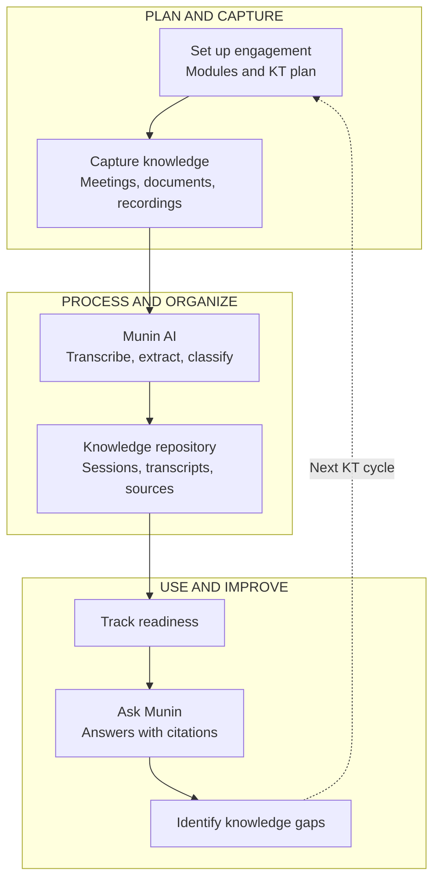
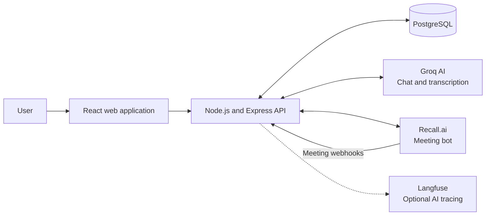
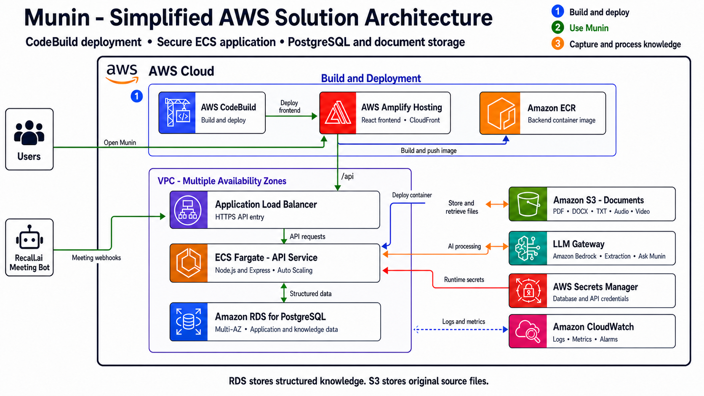
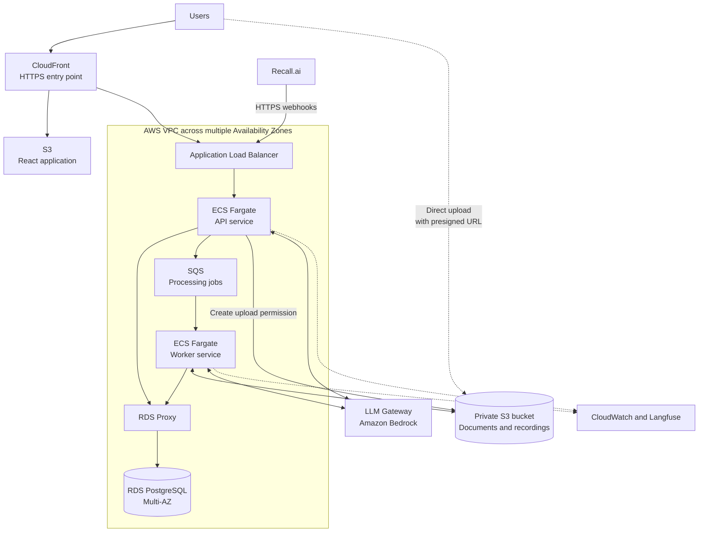
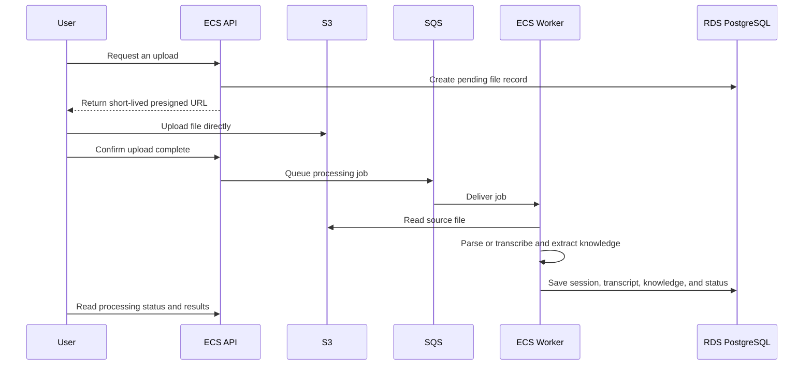

# Munin High-Level Architecture

## 1. What Munin does

Munin is a knowledge-transfer platform. It captures meetings, documents, and recordings; turns them into structured knowledge; tracks transfer readiness; and lets users ask questions with links back to the source sessions.

At a high level, the product has three stages:



---

## 2. Current application architecture



### Main components

| Component | Current responsibility |
|---|---|
| React frontend | Engagement setup, dashboard, sessions, meetings, knowledge base, SME insights, and Ask Munin |
| Express backend | REST APIs, validation, orchestration, uploads, meeting webhooks, and AI workflows |
| PostgreSQL | Engagements, modules, sessions, transcripts, knowledge objects, readiness, SMEs, meetings, chat history, citations, and gaps |
| Groq | Knowledge extraction, module classification, Ask Munin responses, and recording transcription |
| Recall.ai | Joins online meetings and sends transcript events to Munin |
| Langfuse | Optional tracing and diagnostics for AI requests |

The frontend is organized by product feature. Each feature generally owns its page, API functions, React Query hooks, and UI components. Shared API and UI code sits under the frontend's shared folders.

The backend is organized into Express routes and reusable services. PostgreSQL access is centralized in `src/db.js`; AI retrieval and matching are grouped under `src/services/ai-core`.

### Core application flows

#### Live meeting

1. A user asks Munin to join a meeting.
2. The backend creates a meeting bot through Recall.ai.
3. Recall.ai sends participant and transcript events to the webhook API.
4. Transcript chunks are stored in PostgreSQL.
5. Munin periodically extracts knowledge and associates it with an existing engagement module.
6. If no module is a sufficiently good match, the session remains **Unclassified**.
7. Readiness and SME insights are recalculated.

#### Document or recording

1. The browser uploads a file to the Express API.
2. The API temporarily holds the file in memory.
3. Text is extracted from a document, or audio is transcribed.
4. Groq extracts structured knowledge and classifies it.
5. The session, transcript, and knowledge objects are saved in PostgreSQL.
6. The original file is currently discarded after processing.

#### Ask Munin

1. The user asks a question within an engagement.
2. The backend searches relevant knowledge objects and transcript segments.
3. Some factual dashboard questions are answered directly from PostgreSQL.
4. Other questions are sent to Groq with the retrieved context and recent chat history.
5. Returned citation identifiers are checked against the retrieved sources.
6. The answer and citation data are stored in PostgreSQL. A citation resolves to the session's current name, so renaming a session does not invalidate it.

### Current data model, simplified

```text
Engagement
  |-- Modules and planned KT sessions
  |-- Sessions
  |     |-- Transcript segments
  |     `-- Knowledge objects
  |-- Meetings and transcript chunks
  |-- Readiness and SME insights
  `-- Ask Munin conversations and messages
```

### Current production gaps

- Uploaded source files are not retained. They are processed in API memory and only their extracted content is saved.
- Document and recording processing happens inside the HTTP request, which can cause timeouts or high memory use for larger files.
- Meeting progress partly depends on browser polling. Processing should continue even when no user has the page open.
- Server-sent event clients are held in one Node.js process, so updates are not coordinated across multiple API containers.
- Database schema creation and demo seeding run during application startup. Production releases should use controlled, versioned migrations.
- Authentication is a demo flow, not production identity or authorization.
- Engagement separation is suitable for the current MVP, but it is not yet strong tenant isolation for multiple customer organizations.
- The local Cloudflare tunnel is a development convenience and is not part of the AWS architecture.

---

## 3. Proposed AWS architecture



The recommended baseline keeps the existing React, Express, and PostgreSQL design. It uses Amplify Hosting with CloudFront for the React frontend, ECS Fargate for the API, RDS PostgreSQL, durable S3 file storage, and an LLM Gateway backed by Amazon Bedrock. CodeBuild builds and deploys the application.

The following is an optional scale-out evolution for long-running document and recording processing. SQS and a separate worker are not required for the initial deployment.



### AWS service responsibilities

| AWS service | Purpose in Munin |
|---|---|
| CloudFront and ACM | One secure public entry point, TLS certificates, and fast delivery of the web application |
| S3 frontend bucket | Hosts the compiled React application; it remains private behind CloudFront |
| Application Load Balancer | Routes `/api` traffic and Recall.ai webhooks to healthy API containers |
| ECS Fargate API service | Runs the Express backend without managing EC2 servers; use at least two tasks for production |
| ECS Fargate worker service | Processes document and recording jobs independently of browser requests |
| LLM Gateway and Amazon Bedrock | Provides one governed entry point for transcription, extraction, and Ask Munin model calls |
| Amazon ECR | Stores versioned backend container images |
| RDS for PostgreSQL | Stores the structured application and knowledge data |
| RDS Proxy | Reuses database connections as ECS tasks scale and improves database failover handling |
| S3 source-file bucket | Stores the original documents, audio, and video as private objects |
| SQS and a dead-letter queue | Buffers processing work, retries temporary failures, and isolates permanently failed jobs |
| Secrets Manager | Stores database credentials and Recall.ai and Langfuse secrets; Bedrock access uses the ECS task role |
| CloudWatch | Central logs, metrics, dashboards, and alarms for the API, workers, queues, and database |
| Cognito or an enterprise identity provider | Replaces the demo login with real user identity and access control |

### Where each kind of data belongs

| Data | Storage |
|---|---|
| Engagements, modules, and plans | RDS PostgreSQL |
| Sessions and processing status | RDS PostgreSQL |
| Transcript text and knowledge objects | RDS PostgreSQL |
| Chat history, citations, readiness, and SME insights | RDS PostgreSQL |
| Original PDF, DOCX, text, audio, and video files | Private S3 source-file bucket |
| Temporary processing messages | SQS |
| Credentials and API keys | Secrets Manager |
| Application and audit logs | CloudWatch |

Large source files should not be stored directly in PostgreSQL. RDS stores searchable metadata and knowledge; S3 stores the original binary objects.

### Proposed document and recording flow



This avoids sending large files through the API container and lets long AI processing continue after the browser closes. A simple first release could save uploads to S3 but continue processing them synchronously; the worker and queue are the recommended production target.

Add a small source-file record in PostgreSQL with fields such as:

- engagement and session identifiers
- S3 bucket and object key
- original filename, media type, size, and checksum
- processing state: `pending`, `uploaded`, `queued`, `processing`, `complete`, or `failed`
- processing error and timestamps

The database stores an S3 object key, never a public file URL. Downloads should use short-lived authorized URLs.

### Proposed meeting flow

1. The ECS API asks Recall.ai to join the meeting and supplies the public AWS webhook URL.
2. Recall.ai sends transcript events through CloudFront or the load balancer to the API.
3. The API quickly validates and stores transcript chunks, then queues extraction work.
4. Workers perform incremental and final extraction and update PostgreSQL.
5. A scheduled reconciliation job checks meetings that did not receive a final webhook. Processing no longer depends on an open browser tab.

### Security and networking

- Use a VPC spanning at least two Availability Zones.
- Keep ECS tasks and RDS in private subnets. Only CloudFront and the load balancer are public entry points.
- Allow database traffic only from the API and worker security groups through RDS Proxy.
- Block all public access on both S3 buckets and encrypt S3 and RDS data at rest. Use AWS KMS where customer-managed keys are required.
- Give each ECS service a narrowly scoped IAM task role. The API may create presigned uploads and queue work; workers may read source objects and update processing results.
- Keep secrets out of `.env` files in deployed containers. Load them from Secrets Manager at runtime.
- Use Cognito or the organization's existing OIDC/SAML identity provider and enforce engagement authorization in the backend.
- Use AWS WAF on CloudFront or the load balancer if the application is internet-facing.

### Reliability and operations

- Run at least two API tasks across Availability Zones and scale them using CPU, memory, and request count.
- Scale workers independently using SQS queue depth.
- Use RDS PostgreSQL Multi-AZ, automated backups, point-in-time recovery, encryption, and maintenance windows.
- Enable S3 versioning or retention policies according to business needs, plus lifecycle rules for old source files.
- Send failed jobs to an SQS dead-letter queue and expose the failure state in the UI.
- Use `/api/health` for load-balancer health checks and CloudWatch alarms for errors, latency, unhealthy tasks, queue age, and database capacity.
- Keep Langfuse for AI-specific tracing while CloudWatch covers infrastructure and application health.

### Deployment approach

1. Run backend and frontend tests in CI.
2. Build the React application, copy it to the private frontend S3 bucket, and invalidate CloudFront.
3. Build the backend container, scan it, and publish it to ECR.
4. Run versioned database migrations as a one-off ECS task.
5. Deploy the API and worker ECS services with a rolling or blue/green deployment.
6. Keep separate AWS environments and secrets for development, staging, and production.

The Cloudflare quick tunnel and `localhost` URLs remain local-development tools. In AWS, configure the permanent HTTPS application URL as the frontend API base and the Recall.ai webhook base.

---

## 4. Practical migration path

### Phase 1: Containerize the current application

- Add a backend Dockerfile and run the Express API on ECS Fargate.
- Host the React build in S3 behind CloudFront.
- Connect ECS to RDS PostgreSQL and move deployed secrets to Secrets Manager.
- Introduce controlled database migrations instead of schema changes during API startup.

### Phase 2: Make source files durable

- Add the source-file database record.
- Upload documents and recordings directly to private S3 with presigned URLs.
- Preserve current synchronous processing initially if the fastest migration is required.

### Phase 3: Separate background processing

- Add SQS and the ECS worker service.
- Move document parsing, recording transcription, knowledge extraction, and meeting reconciliation into workers.
- Add retries, dead-letter handling, and visible processing status.

### Phase 4: Production hardening

- Add real authentication and backend authorization.
- Strengthen organization and engagement tenant boundaries.
- Enable Multi-AZ, autoscaling, alarms, backup testing, retention rules, and operational runbooks.
- Replace process-local live events with a shared mechanism only if real-time push is required. Polling is sufficient for the first production version.

---

## 5. Recommended outcome

The application remains straightforward:

```text
React UI -> ECS API -> RDS PostgreSQL
                 |
                 +-> S3 for original files
                 +-> SQS -> ECS workers for long processing
                 +-> LLM Gateway, Amazon Bedrock, Recall.ai, and Langfuse
```

This design keeps the existing product model, makes uploaded source material durable, supports safe scaling, and separates quick user requests from long-running AI work.

## AWS reference links

- [Load balancing Amazon ECS services](https://docs.aws.amazon.com/AmazonECS/latest/developerguide/service-load-balancing.html)
- [Uploading with Amazon S3 presigned URLs](https://docs.aws.amazon.com/AmazonS3/latest/userguide/using-presigned-url.html)
- [Amazon RDS Proxy](https://docs.aws.amazon.com/AmazonRDS/latest/UserGuide/rds-proxy.html)
- [Amazon RDS Multi-AZ deployments](https://docs.aws.amazon.com/AmazonRDS/latest/UserGuide/Concepts.MultiAZ.html)
- [Using Secrets Manager from Amazon ECS](https://docs.aws.amazon.com/AmazonECS/latest/developerguide/secrets-app-secrets-manager.html)
